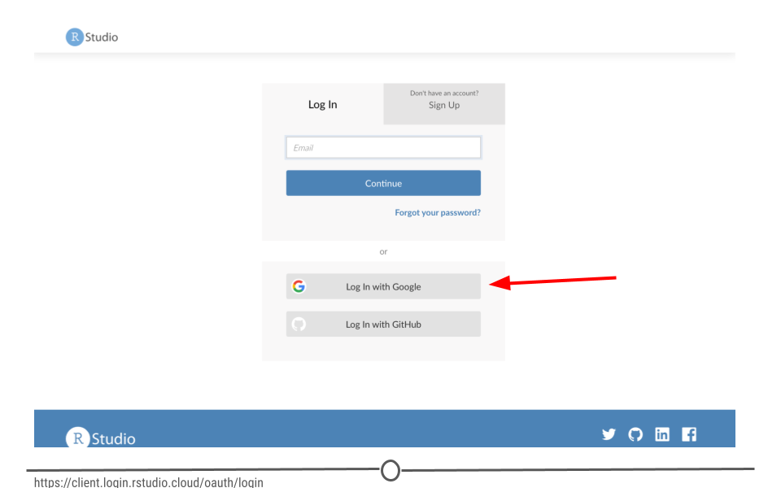
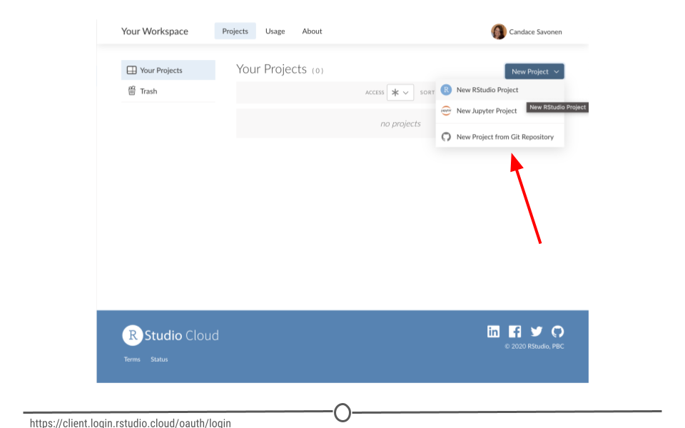
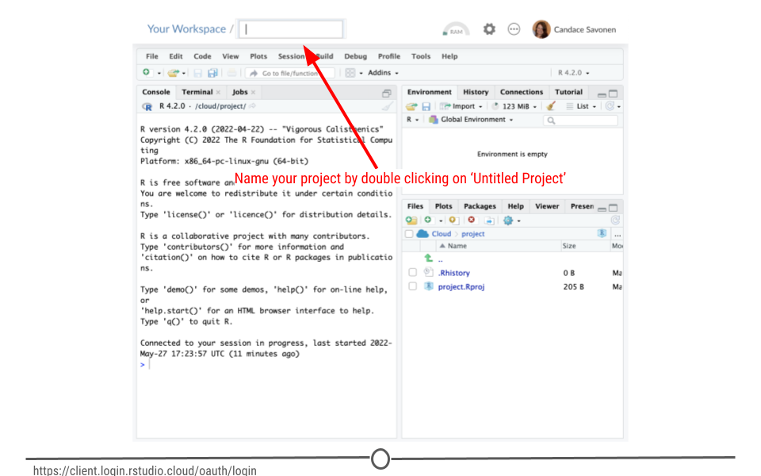
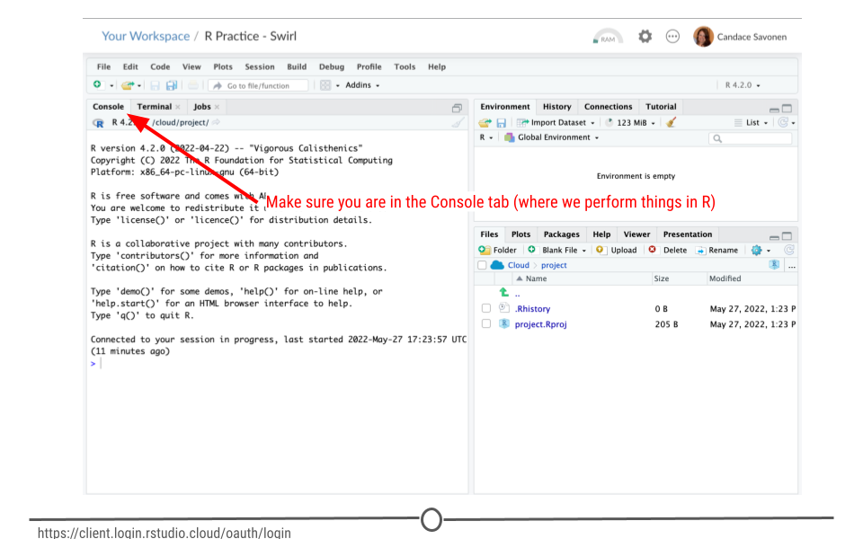
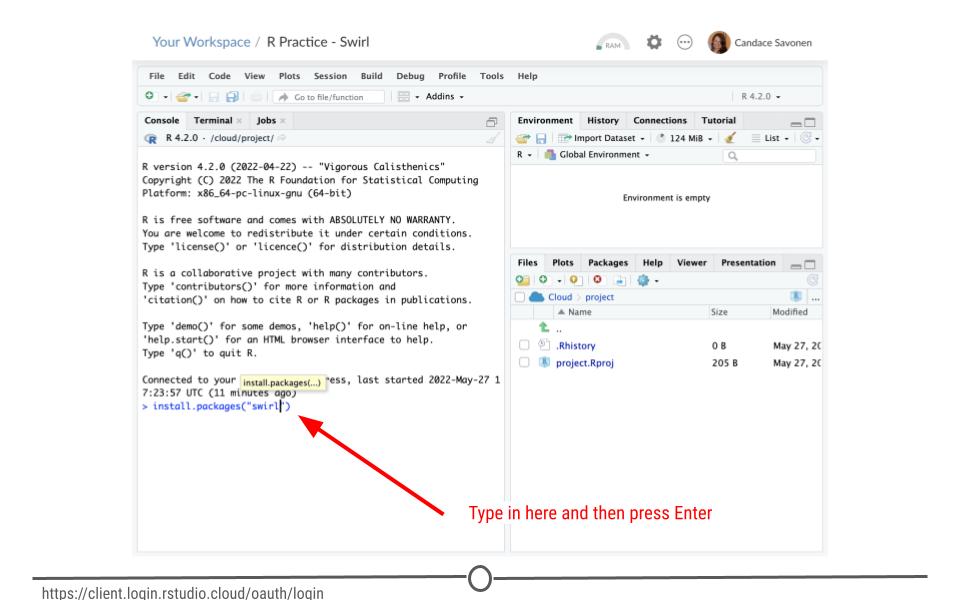
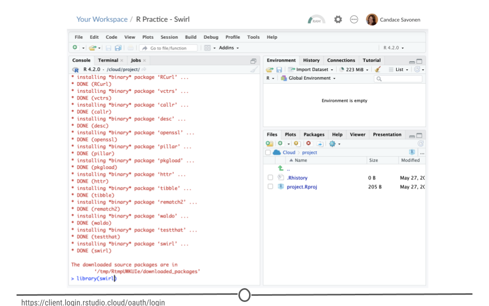
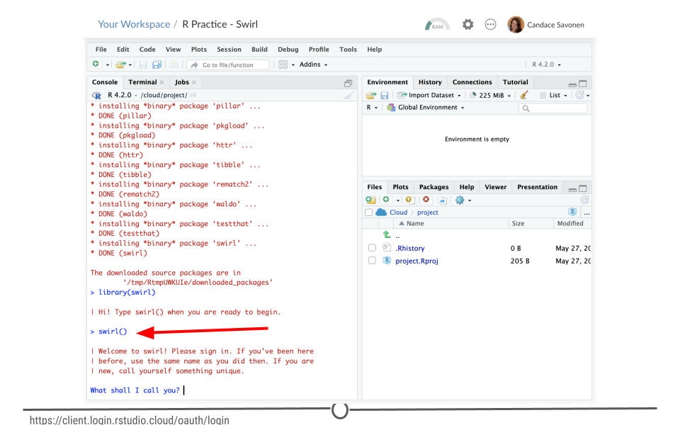

# Swirl

[Swirl](https://swirlstats.com/) is a handy package for learning R because it is an interactive R package that teaches you how to use R right from the R console!

* Swirl allows you to interactively practice R at your own pace in a variety of lessons
* Swirl is free, and no login is required!

Keep in mind, we will be using DataTrail specific swirl courses later on for even more learning so getting accustomed to swirl now is a great idea!

## Set up Swirl for R practice

### Step 1: Create a new RStudio cloud project

Navigate to [RStudio Cloud](rstudio.cloud). If you are not logged in, login with your Google login.



Click on `Your workspace`. We are going to create a separate project to use for practicing R with the Swirl package.
Click on `New Project` and choose `New RStudio Project`. This will take a few seconds to generate.


Click on the `Untitled Project` title at the top of the screen and give your project a title that has something to do with practicing R with Swirl. For example `R Practice - Swirl`.



### Step 2: Install Swirl

Navigate to the `Console` tab (the tab we will use for commands we are running in R)


Copy and paste this command and then press Enter on your keyboard:

```r
install.packages("swirl")
```
This will take a minute or so to install. (Remember red text doesn't mean errors necessarily).



### Step 3: Start Swirl

In the `Console` tab, copy and paste this command and then press Enter to attach the Swirl library:

```
library("swirl")
```
To use packages we've installed in R, we have to tell R to go retrieve them before we can use them. More about this later.



Now to start Swirl, run this command (and click Enter)
```
swirl()
```




Swirl is going to start talking to you. You can type your responses as your are prompted and click Enter when you are ready.

Read each set of prompts from Swirl carefully and respond accordingly. When you are asked which course you would like to complete, select `R Programming: The basics of programming in R` by press `1` and Enter when you are prompted.

### Step 4: Start 'R Programming' Swirl course

When prompted with:
```
| Course installed successfully!
| Please choose a course, or type 0 to exit swirl.

1: R Programming
2: Take me to the swirl course repository!
```
Press `1` and hit Enter to start working on the `R Programming` course!

### Step 5: Working through the course lessons

Start working your way through the course lessons. Complete lessons 1 - 8 at your own pace.  

Follow the prompts; congrats you are programming!

### More R programming lessons (Optional)

Do you want more resources for learning R after completing the 8 lessons? There's a lot of great ones out there (and we will go through more R programming in later courses):

- [RStudio Cloud Primers](https://rstudio.cloud/learn/primers)
- [Roger's R Programming course](https://www.coursera.org/learn/r-programming)
- [R for Data Science](https://r4ds.had.co.nz/)
